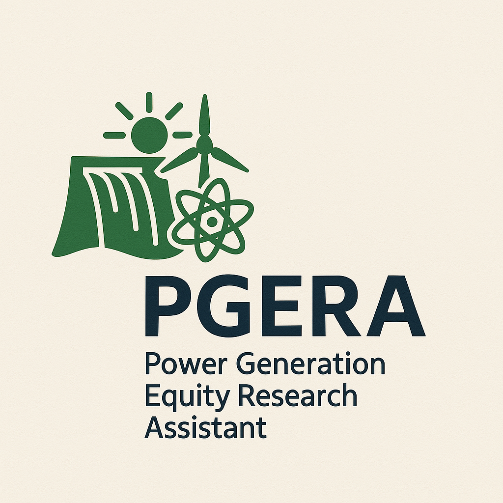

# MVP - Pipeline de dados para análise fundamentalista no setor de geração de energia elétrica

## Introdução

Este projeto é um MVP (Minimum Viable Product) desenvolvido como parte do trabalho da disciplina de Engenharia de Dados da PUC-RIO. O objetivo principal é construir um pipeline de dados que auxilie analistas de investimentos, especialmente aqueles que realizam análises fundamentalistas (equity research), a obter e analisar informações financeiras de empresas do segmento de geração de energia elétrica.

### Sobre o PGERA (Power Generation Equity Research Assistant)

A ideia do PGERA (Power Generation Equity Research Assistant) foi concebida dada a necessidade de uma ferramenta especializada para apoiar analistas de investimentos que se concentram especificamente no setor de geração de energia elétrica. Este assistente visa atender às necessidades dos analistas especialistas neste segmento, que precisam de acesso rápido e estruturado a dados financeiros e operacionais para realizar avaliações.

É importante ressaltar que muitas empresas do setor elétrico atuam em múltiplos segmentos da cadeia energética (geração, transmissão e distribuição). Nestes casos, o PGERA poderá fornecer suporte ao analista especializado em geração, que deverá trabalhar em colaboração com analistas especializados nas áreas de transmissão e distribuição para realizar uma avaliação completa e integrada da empresa. 

Atenção! Todo o código está consolidado em um único notebook Jupyter (`pgera_dfps.ipynb`) para facilitar a avaliação. A infraestutura utilizada foi desdobrada em um ambiente de desenvolvimento no Google Cloud Platform (GCP), utilizando o Google Cloud Storage (GCS) para armazenamento dos dados e o Google Dataproc para processamento com Apache Spark. O código foi desenvolvido em Python.

## Contexto do trabalho

Este trabalho integra o desenvolvimento prático das competências adquiridas na disciplina de Engenharia de Dados. Com o crescimento da complexidade dos mercados e a necessidade de análises cada vez mais precisas, o foco deste projeto é facilitar a obtenção e padronização dos dados extraídos das demonstrações financeiras das empresas do setor elétrico.

A análise fundamentalista é essencial para o processo de valuation (avaliação) das empresas, permitindo aos analistas determinar o valor justo das ações com base em dados financeiros concretos, comparando-os com o preço atual de mercado para identificar oportunidades de investimento. Este pipeline visa fornecer dados estruturados que possam alimentar modelos de valuation, facilitando decisões estratégicas de investimento.

## Objetivos do projeto

O principal objetivo deste MVP é desenvolver um pipeline de dados inicial que permita:

- **Coleta automatizada:** Obtenção de dados padronizados das demonstrações financeiras padronizadas (DFPs) das empresas, no site da CVM.
- **Integração e padronização:** Consolidação e tratamento básico dos dados financeiros, garantindo consistência para análises preliminares.
- **Instrumental intermediário de análise:** Preparação dos dados financeiros para fazer análises de balanço tais como análise horizontal e vertical, alavancagem operacional e financeira, estudo do fluxo de fundos no ativo circulante, acompanhamento de indicadores de liquidez e de ciclo operacional, entre muitos outros. 

Embora a visão de longo prazo inclua a integração de dados de notícias, informações de agências reguladoras (como dados sobre usinas e consumo de energia) e análises de outros especialistas, o foco inicial deste MVP está na estruturação dos dados financeiros fundamentais.

Prevê-se, ainda, uma futura integração com modelos de linguagem (LLMs) para oferecer suporte adicional na geração interativa de relatórios, agregando análises textuais aos dados financeiros.

## Carga de dados e ETL até a camada silver

O processo de ingestão e transformação inicial dos dados (ETL) é fundamental para estruturar as informações financeiras antes das análises. As etapas principais são:

1.  **Extração da fonte:** Os dados brutos das Demonstrações Financeiras Padronizadas (DFPs) são obtidos diretamente do repositório FTP da CVM (`dados.cvm.gov.br`). Arquivos ZIP anuais contendo múltiplos arquivos CSV são baixados.
2.  **Processamento e armazenamento na camada bronze:** Os arquivos ZIP são extraídos, e cada arquivo CSV é lido individualmente utilizando Pandas. Nesta etapa, são aplicadas configurações de codificação (`latin1`) e tipos de dados específicos. Os DataFrames resultantes de cada ano são salvos em formato Parquet no Google Cloud Storage (GCS), constituindo a camada bronze (`gs://pgera-bronze/dfps/`).
3.  **Consolidação e armazenamento na camada silver:** Os arquivos Parquet anuais da camada Bronze são lidos, filtrados pelas empresas de interesse (setor elétrico) e enriquecidos com colunas adicionais (como o ano extraído da data de referência). Os dados de múltiplos anos são então consolidados em um único DataFrame, que é salvo em formato Parquet na camada Silver (`gs://pgera-silver/dfps/dfps_consolidated.parquet`).
4.  **Criação do esquema estrela na camada silver:** Utilizando Apache Spark SQL sobre os dados consolidados na camada Silver, um esquema em estrela é construído para facilitar consultas analíticas. Este esquema consiste em:
    *   `dim_empresa`: Dimensão com informações das companhias (CNPJ, nome).
    *   `dim_tempo`: Dimensão com informações temporais (ano).
    *   `dim_metrica`: Dimensão com informações das contas financeiras (código, nome, categoria).
    *   `fato_dfp`: Tabela fato contendo os valores (`vl_conta`) associados às dimensões. É importante notar que esta tabela é tratada para conter apenas a versão mais recente (`MAX(versao)`) de cada conta para um dado CNPJ e ano.

Sobre a qualidade dos dados da CVM, em nenhum momento foram observadas inconsistências ou erros nos dados financeiros padronizados, reduzindo a necessidade de tratamentos especiais. No entanto, é importante ressaltar que a CVM não garante a veracidade dos dados, e os analistas devem sempre validar as informações antes de utilizá-las para decisões de investimento.

O fluxo de dados até a criação do esquema estrela na camada Silver pode ser visualizado abaixo:

## Construção e uso da camada gold

A camada Gold é construída sobre o esquema estrela da camada Silver e contém tabelas agregadas e métricas calculadas, otimizadas para análises financeiras específicas e consumo por ferramentas de BI ou dashboards. O objetivo é fornecer visões pré-processadas que respondam diretamente a perguntas de negócio.

O foco inicial será a construção de análises horizontais baseada no livro Estrutura e Análise de Balanços de Alexandre Assaf Neto, que propõe uma abordagem sistemática para a análise de balanços patrimoniais e demonstrações de resultados. A análise horizontal envolve a comparação de dados financeiros ao longo do tempo, permitindo identificar tendências e variações. 

Neste projeto, a camada Gold reside no GCS (`gs://pgera-gold/`) dentro de um banco de dados chamado `horizontal_analysis`. As principais tabelas criadas são:

1.  **`assets_liabilities_analysis`**: Tabela pivotada contendo os valores anuais das principais contas do Balanço Patrimonial (Ativo Total, Passivo Total, PL, etc.) para cada empresa. Facilita a análise horizontal da evolução patrimonial.
2.  **`income_statement_analysis`**: Tabela pivotada similar à anterior, mas focada nas contas da Demonstração do Resultado do Exercício (DRE), como Receita Líquida, Resultado Bruto, Lucro Líquido, etc. Permite a análise horizontal da performance operacional.
3.  **`profitability_metrics`**: Contém métricas de rentabilidade calculadas anualmente para cada empresa, como Margem Bruta, Margem Líquida, Retorno sobre Ativos (ROA) e Retorno sobre Patrimônio Líquido (ROE).
4.  **`liquidity_metrics`**: Apresenta índices de liquidez calculados anualmente, incluindo Liquidez Corrente, Liquidez Imediata (estimada), Liquidez Geral e Nível de Endividamento percentual.

Estas tabelas da camada Gold são a base para as visualizações e análises comparativas apresentadas no notebook `pgera_dfps.ipynb`, como gráficos de evolução de indicadores e dashboards comparativos entre empresas.

Os diagramas abaixo ilustram a derivação das tabelas da camada Gold a partir do esquema estrela da camada Silver:

## Catálogo de dados da camada gold (`horizontal_analysis`)

A camada Gold (`gs://pgera-gold/horizontal_analysis/`) contém tabelas agregadas e métricas calculadas, prontas para análise e visualização. Abaixo está um catálogo das principais tabelas geradas neste projeto:

| Tabela                          | Descrição                                                                                                | Localização (GCS)                                                    |
| :------------------------------ | :------------------------------------------------------------------------------------------------------- | :------------------------------------------------------------------- |
| `companies`                     | Tabela de dimensão com CNPJ e nome das empresas analisadas.                                              | `gs://pgera-gold/horizontal_analysis/companies/`                     |
| `assets_liabilities_analysis` | Análise horizontal anual das principais contas do Balanço Patrimonial (Ativo, Passivo, PL).                | `gs://pgera-gold/horizontal_analysis/assets_liabilities_analysis/` |
| `income_statement_analysis`   | Análise horizontal anual das principais contas da Demonstração de Resultado (Receita, Custos, Lucro).    | `gs://pgera-gold/horizontal_analysis/income_statement_analysis/`   |
| `profitability_metrics`       | Métricas de rentabilidade calculadas anualmente (Margens, ROA, ROE).                                       | `gs://pgera-gold/horizontal_analysis/profitability_metrics/`       |
| `liquidity_metrics`           | Índices de liquidez calculados anualmente (Corrente, Imediata (estimada), Geral, Endividamento).          | `gs://pgera-gold/horizontal_analysis/liquidity_metrics/`           |

## Autoavaliação do MVP

Este MVP representa um passo inicial na construção de uma ferramenta robusta para análise fundamentalista no setor de geração de energia elétrica, focando na estruturação e análise inicial dos dados financeiros.

**Objetivos atingidos:**

Conseguimos atingir os objetivos primários delineados para este MVP:
*   Implementamos um pipeline automatizado para coleta (via `requests` e `BeautifulSoup`), processamento inicial (com `Pandas`) e armazenamento (em GCS) dos dados das demonstrações financeiras padronizadas (DFPs) da CVM, formando a camada bronze.
*   Utilizamos `Apache Spark SQL` para transformar os dados da camada bronze, construindo um esquema estrela (tabelas `dim_empresa`, `dim_tempo`, `dim_metrica`, `fato_dfp`) na camada silver, garantindo a seleção da versão mais recente (`MAX(versao)`) das demonstrações.
*   Desenvolvemos a camada gold com tabelas agregadas e métricas financeiras essenciais, armazenadas no GCS (`gs://pgera-gold/horizontal_analysis/`). Isso incluiu:
    *   Tabelas pivotadas para análise horizontal do balanço patrimonial (`assets_liabilities_analysis`) e da DRE (`income_statement_analysis`).
    *   Cálculo e armazenamento de métricas de rentabilidade (`profitability_metrics`), como margens bruta/operacional/líquida, ROA e ROE.
    *   Cálculo e armazenamento de índices de liquidez (`liquidity_metrics`), como liquidez corrente/geral e nível de endividamento, incluindo uma *estimativa* para a liquidez imediata.
*   Demonstramos o uso dessas camadas através de análises e visualizações (com `Matplotlib`) no notebook `pgera_dfps.ipynb`, incluindo comparações temporais e entre empresas selecionadas.

**Dificuldades e limitações:**

*   **Generalidade da análise:** A principal limitação reside na análise puramente baseada nos dados financeiros padronizados da CVM. O MVP ainda não incorpora informações cruciais e específicas do setor elétrico (dados operacionais da ANEEL/ONS, contexto regulatório, etc.), o que restringe a profundidade das conclusões fundamentalistas.
*   **Qualidade e granularidade dos dados:** Embora padronizados, os dados da CVM podem apresentar variações na nomenclatura ou detalhamento de contas entre empresas ou ao longo do tempo (ex: diferentes nomes para lucro líquido ou PL), exigindo tratamento específico (como visto na consolidação de `lucro_liquido` e `patrimonio_liquido` na camada gold). A falta de detalhamento direto de certas contas (como caixa e equivalentes) levou à necessidade de estimativas (ex: liquidez imediata).
*   **Complexidade da modelagem:** A criação de um esquema estrela robusto e o cálculo consistente de métricas financeiras, tratando corretamente agregações e possíveis divisões por zero, apresentaram desafios técnicos inerentes à modelagem de dados financeiros.

**Trabalhos futuros:**

Para enriquecer o PGERA e torná-lo uma ferramenta de análise mais poderosa e significativa, os próximos passos poderiam incluir:

*   **Integração de dados setoriais:** Correlacionar os dados financeiros com informações específicas do setor elétrico, como dados da ANEEL (Agência Nacional de Energia Elétrica) sobre capacidade instalada, garantia física, resultados de leilões de energia, dados de consumo e geração do ONS (Operador Nacional do Sistema Elétrico), e tendências regulatórias.
*   **Ampliação das fontes da CVM:** Incorporar outros conjuntos de dados disponibilizados pela CVM, como informações sobre eventos corporativos (ITR), composição acionária e fatos relevantes.
*   **Refinamento das métricas:** Calcular métricas mais sofisticadas, como fluxo de caixa livre, EVA (Economic Value Added), e detalhar componentes do capital de giro. Buscar formas de obter ou estimar com maior precisão contas como caixa e equivalentes para melhorar o cálculo da liquidez imediata.
*   **Análises comparativas aprofundadas:** Desenvolver análises verticais, de ciclo operacional/financeiro, e comparações mais detalhadas entre empresas do mesmo porte ou com estratégias semelhantes (ex: puras geradoras vs. integradas).
*   **Incorporação de análises externas:** Integrar relatórios e projeções de outros analistas de mercado (equity research) para fornecer contexto adicional.
*   **Integração com LLMs:** Avançar na integração com modelos de linguagem grandes (LLMs) para permitir consultas em linguagem natural e geração de insights e relatórios preliminares de forma interativa.
*   **Visualização avançada:** Criar dashboards interativos mais sofisticados (ex: usando Streamlit, Dash ou Looker Studio conectado ao GCS/BigQuery) para visualização dos dados e resultados das análises.

Essas melhorias transformariam o PGERA de um pipeline de dados financeiros em uma plataforma de análise setorial mais completa, agregando maior valor aos analistas de equity research especializados em geração de energia.